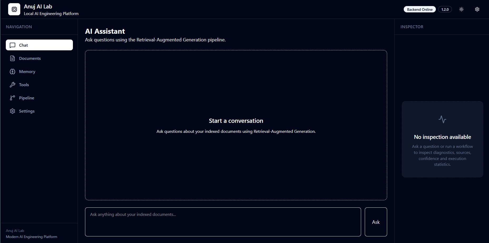
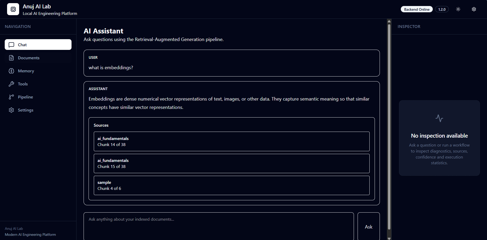
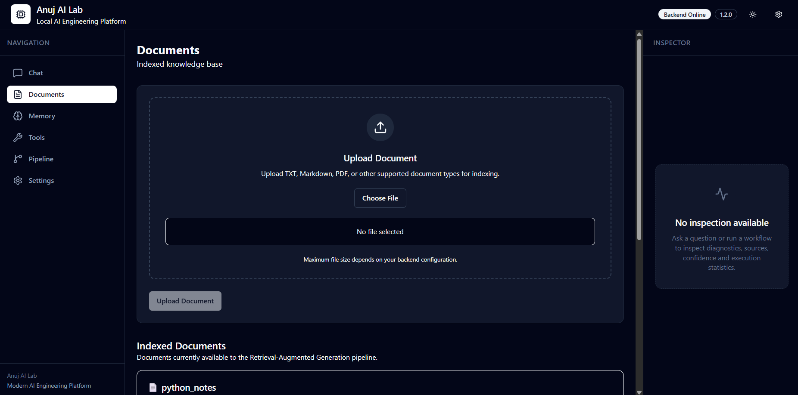
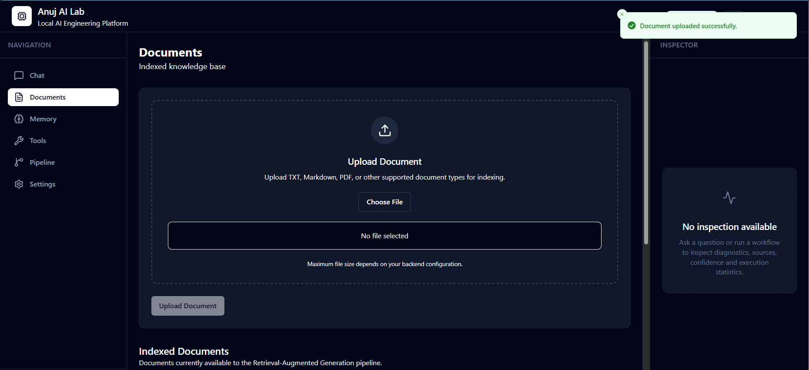
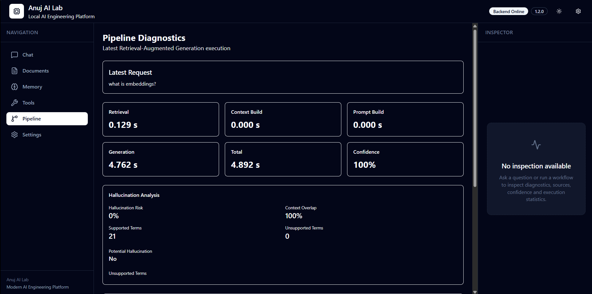
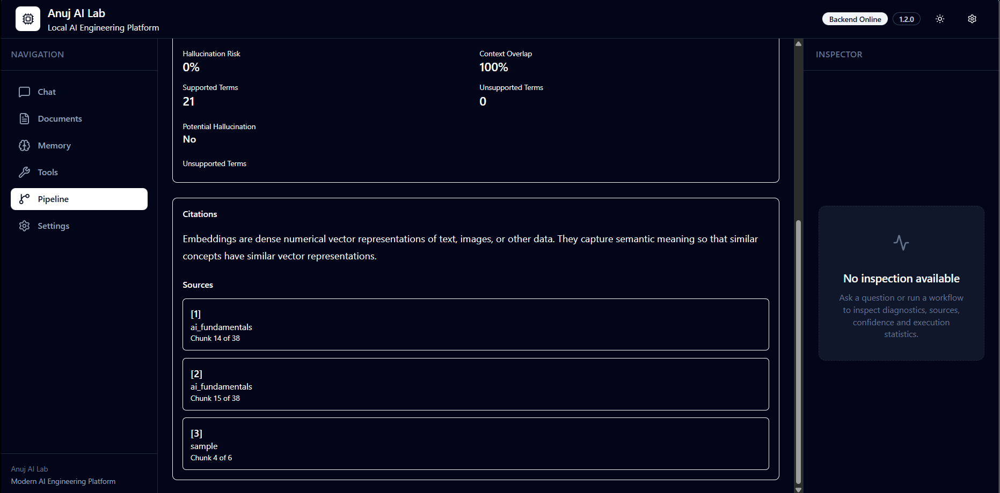
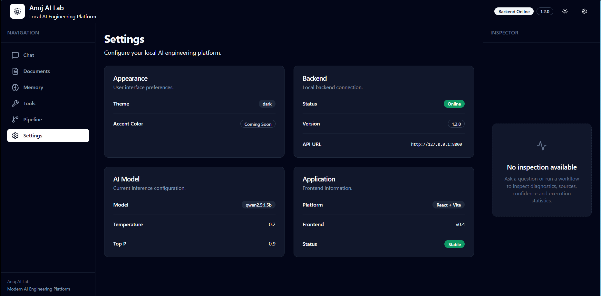
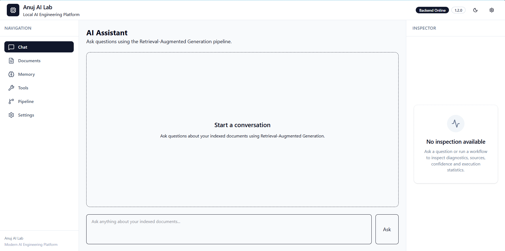

# 🚀 Anuj AI Lab

> **A production-grade Local AI Engineering Platform for building Retrieval-Augmented Generation (RAG), AI Assistants, Memory Systems, Tool Calling, and Agentic AI workflows using FastAPI, React, TypeScript, Ollama, and ChromaDB.**

Build modern AI systems completely on your own machine—from document ingestion and semantic retrieval to diagnostics, observability, memory, and autonomous AI agents—all inside a modular, scalable engineering platform.

---


---

## 📈 Repository Overview

| Category | Details |
|----------|---------|
| Language | Python, TypeScript |
| Backend | FastAPI |
| Frontend | React 19 |
| AI Runtime | Ollama |
| Vector Database | ChromaDB |
| Current Version | v2.1.0 |
| Development Stage | Stage 4 – Persistent Memory |
| Architecture | Modular AI Engineering Platform |
| License | MIT |

---

## 📚 Table of Contents

- [Overview](#overview)
- [Why Anuj AI Lab?](#why-anuj-ai-lab)
- [Portfolio Summary](#portfolio-summary)
- [Key Features](#key-features)
- [Performance Highlights](#performance-highlights)
- [Current Roadmap](#current-roadmap)
- [Technology Stack](#technology-stack)
- [System Architecture](#system-architecture)
- [High-Level RAG Pipeline](#high-level-rag-pipeline)
- [Performance Improvements](#performance-improvements)
- [Project Structure](#project-structure)
- [Engineering Principles](#engineering-principles)
- [Getting Started](#-getting-started)
- [API Overview](#api-overview)
- [Project Gallery](#-project-gallery)
- [Development Timeline](#development-timeline)
- [Release History](#release-history)
- [Roadmap](#-roadmap)
- [Current Project Status](#-current-project-status)
- [Engineering Highlights](#-engineering-highlights)
- [Performance Snapshot](#-performance-snapshot)
- [Contributing](#-contributing)
- [License](#-license)
- [Author](#-author)

---

# Overview

Anuj AI Lab is a modular AI engineering platform focused on building production-quality Retrieval-Augmented Generation (RAG) systems using local large language models.

Unlike traditional chatbot projects, this repository emphasizes software engineering principles including modular architecture, observability, diagnostics, performance optimization, clean abstractions, and scalable system design.

The long-term vision is to evolve this project into a fully local Agentic AI platform capable of persistent memory, tool execution, autonomous planning, multi-agent collaboration, and production-ready AI workflows.

---

# Philosophy

Anuj AI Lab is built around one principle:

> Build AI systems, not AI demos.

The goal is not simply to connect a language model to a frontend, but to engineer the complete ecosystem required for reliable AI applications.

Every feature is designed with modularity, observability, maintainability, and scalability in mind so the platform can continuously evolve from a local RAG engine into a production-ready Agentic AI platform.

---

# Why Anuj AI Lab?

Most AI projects stop after connecting an LLM to a UI.

This project focuses on engineering the complete AI system around the model.

It includes:

- Modular FastAPI backend
- Modern React + TypeScript workspace
- Retrieval-Augmented Generation (RAG)
- Hybrid document retrieval
- Vector database integration
- Pipeline diagnostics
- Performance profiling
- Citation generation
- Hallucination analysis
- Embedding provider abstraction
- Production-oriented project architecture

Every subsystem is designed to be independently maintainable, testable, and extensible.

---

# Portfolio Summary

## Current Release

**v2.1.0 — High-Performance RAG Engine**

---

## Completed Stages

✅ Stage 1 — AI Foundations

- FastAPI backend
- Ollama integration
- Prompt engineering
- REST APIs
- Modular project structure

---

✅ Stage 2 — Connectors & AI Services

- External connectors
- Workflow engine
- AI service abstraction
- File processing
- Voice integration

---

✅ Stage 3 — Retrieval-Augmented Generation

- Document ingestion
- Automatic chunking
- ChromaDB integration
- Embedding generation
- Semantic retrieval
- Context builder
- Prompt builder
- Citation support

---

✅ Stage 3.5 — Modern React Workspace

- React 19
- TypeScript
- Vite
- Tailwind CSS
- React Query
- Zustand
- Multi-page workspace
- Inspector panel
- Document management
- Diagnostics dashboard

---

🚧 Current Focus

## Stage 4 — Memory & Knowledge Systems

Current development focuses on expanding the platform with:

- Persistent memory
- Conversation memory
- Memory retrieval
- User profiles
- Knowledge persistence

while continuing to improve RAG quality, retrieval accuracy, diagnostics, and generation performance.

---

# Key Features

## AI Platform

- Local LLM inference using Ollama
- FastAPI REST architecture
- Modern React workspace
- Modular backend design
- Production-ready project structure

---

## Retrieval-Augmented Generation

- Automatic document ingestion
- Intelligent document chunking
- ChromaDB vector storage
- Semantic search
- Hybrid retrieval pipeline
- Retrieval filtering
- Prompt construction
- Context building
- Source attribution

---

## High-Performance Retrieval Engine

Recent optimizations introduced:

- Pluggable embedding provider architecture
- SentenceTransformer embedding support
- Reuse of stored Chroma embeddings
- Optimized semantic reranking
- Performance instrumentation
- Retrieval diagnostics

---

## Diagnostics & Observability

- Pipeline timing metrics
- Retrieval performance analysis
- Citation mapping
- Grounding diagnostics
- Hallucination detection
- Confidence scoring
- Prompt statistics
- Response statistics
- Pipeline health reporting

---

## Modern Frontend

- React 19
- TypeScript
- Vite
- Tailwind CSS v4
- React Query
- Zustand
- Responsive workspace
- Theme switching
- Inspector panel

---

# Performance Highlights

The latest optimization cycle dramatically improved retrieval performance.

| Component | Before | After |
|-----------|---------:|------:|
| Semantic Reranker | ~50 s | ~0.02 s |
| Retrieval Pipeline | ~50 s | ~0.25 s |
| Vector Search | ~0.005 s | ~0.006 s |

### Highlights

- ~2200× faster semantic reranking
- ~200× faster retrieval pipeline
- Reused stored Chroma embeddings
- Eliminated redundant embedding generation
- Introduced pluggable embedding architecture
- Added detailed pipeline performance profiling

---

# Current Roadmap

| Stage | Status |
|---------|--------|
| Stage 1 – AI Foundations | ✅ Complete |
| Stage 2 – Connectors & AI Services | ✅ Complete |
| Stage 3 – RAG Platform | ✅ Complete |
| Stage 3.5 – Modern React Workspace | ✅ Complete |
| Stage 4 – Memory System | 🚧 In Progress |
| Stage 5 – Tool Calling | ⏳ Planned |
| Stage 6 – AI Agents | ⏳ Planned |
| Stage 7 – Multi-Agent Platform | ⏳ Planned |

---

# 🛠 Technology Stack

## Backend

- Python 3.14
- FastAPI
- Uvicorn
- Pydantic v2
- SQLAlchemy
- Loguru
- HTTPX
- Requests

---

## Frontend

- React 19
- TypeScript
- Vite 8
- Tailwind CSS v4
- React Router
- React Query
- Zustand
- Radix UI
- Lucide React
- shadcn/ui

---

## AI & Machine Learning

- Ollama
- Qwen
- Gemma
- SentenceTransformers
- ChromaDB
- Hybrid Retrieval
- Semantic Search
- Retrieval-Augmented Generation (RAG)

---

## Data & Storage

- SQLite
- Chroma Vector Database
- Local File Storage

---

## Developer Tools

- Git
- GitHub
- VS Code
- Pytest
- Swagger UI

---

# System Architecture

```text
                                           User
                                             │
                                             ▼
                               React 19 + TypeScript Frontend
                    (Chat • Documents • Pipeline • Memory • Settings)
                                             │
                                             ▼
                                 FastAPI REST API Layer
                                             │
═══════════════════════════════════════════════════════════════════════════════════════
                                             │
         ┌──────────────────────┬──────────────────────┬──────────────────────┐
         ▼                      ▼                      ▼
  Document Pipeline      Retrieval Engine      Prompt Pipeline
         │                      │                      │
         ▼                      ▼                      ▼
 Document Loader        Hybrid Retrieval        Prompt Builder
 Chunking               BM25 Search             Prompt Analyzer
 Metadata               Semantic Search         Prompt Optimizer
 Embeddings             Rank Fusion             Prompt Renderer
                         Retrieval Filter       Token Budget Manager
                         Semantic Reranker
                         Semantic Matcher
                                             │
═══════════════════════════════════════════════════════════════════════════════════════
                                             │
                                             ▼
                               Context Construction Layer
                                             │
                        Context Builder • Context Compression
                                             │
                                             ▼
═══════════════════════════════════════════════════════════════════════════════════════
                                             │
                                             ▼
                                 Local AI Inference Layer
                                             │
                    Embedding Providers              Language Models
                   ┌───────────────────┐          ┌──────────────────┐
                   │ SentenceTransformer│          │     Ollama       │
                   │ Ollama Embeddings │          │ Qwen / Gemma     │
                   └───────────────────┘          └──────────────────┘
                                             │
                                             ▼
═══════════════════════════════════════════════════════════════════════════════════════
                                             │
                                             ▼
                              Answer Processing & Validation
                                             │
         ┌──────────────────────┬──────────────────────┬──────────────────────┐
         ▼                      ▼                      ▼
  Answer Processing     Citation Pipeline      Quality Assessment
         │                      │                      │
         ▼                      ▼                      ▼
 Answer Processor      Citation Processor     Answer Quality
                       Citation Grounder      Hallucination Detector
                       Citation Inserter      Contradiction Detector
                                              Answer Consistency
                                              Evidence Aligner
                                             │
═══════════════════════════════════════════════════════════════════════════════════════
                                             │
                                             ▼
                           Diagnostics & Observability Layer
                                             │
             Performance Profiler • Pipeline Health • RAG Scorecard
         Retrieval Explainer • Retrieval Quality • Execution Metrics
                                             │
                                             ▼
═══════════════════════════════════════════════════════════════════════════════════════
                                             │
                                             ▼
                             Chroma Vector Database (Local)
                     Documents • Chunks • Embeddings • Metadata
```

---

# End-to-End RAG Execution Pipeline

```text
                    User Query
                         │
                         ▼
                 Query Processing
                         │
                         ▼
                Query Embedding
                         │
                         ▼
               Hybrid Retrieval Engine
                         │
          ┌──────────────┴──────────────┐
          ▼                             ▼
   Semantic Search                BM25 Search
          │                             │
          └──────────────┬──────────────┘
                         ▼
                   Result Fusion
                         │
                         ▼
                Retrieval Filtering
                         │
                         ▼
                Semantic Reranking
                         │
                         ▼
                Context Construction
                         │
                         ▼
                 Prompt Optimization
                         │
                         ▼
                  Prompt Rendering
                         │
                         ▼
              Local LLM Generation
                         │
                         ▼
               Answer Processing
                         │
          ┌──────────────┼──────────────┐
          ▼              ▼              ▼
    Citation Pipeline  Grounding   Quality Analysis
          │              │              │
          └──────────────┼──────────────┘
                         ▼
              Performance Profiling
                         │
                         ▼
                 Final AI Response
```

---

# Performance Improvements

One of the major engineering milestones of **v2.1.0** was eliminating redundant embedding generation during semantic reranking.

Instead of recomputing document embeddings for every query, the platform now reuses embeddings already stored in ChromaDB.

## Performance Comparison

| Component | Previous | Current |
|-----------|----------:|---------:|
| Query Embedding | ~0.05 s | ~0.07 s |
| Vector Search | ~0.005 s | ~0.006 s |
| Semantic Reranker | ~50 s | ~0.02 s |
| Retrieval Pipeline | ~50 s | ~0.25 s |
| LLM Generation | ~7 s | ~8 s |

### Result

- ~2200× faster semantic reranking
- ~200× faster retrieval pipeline
- Zero redundant embedding computation
- Pluggable embedding provider architecture
- Better diagnostics and observability

---

# Project Structure

```text
anuj-ai-lab/
│
├── backend/
│   ├── app/
│   │   ├── api/                 # REST API endpoints
│   │   ├── core/                # Application configuration
│   │   ├── db/                  # Database layer
│   │   ├── models/              # Shared data models
│   │   ├── services/            # Business services
│   │   ├── utils/               # Utility functions
│   │   │
│   │   └── rag/
│   │       ├── Retrieval/
│   │       │   ├── Hybrid Retrieval
│   │       │   ├── BM25 Retrieval
│   │       │   ├── Keyword Retrieval
│   │       │   ├── Rank Fusion
│   │       │   ├── Result Fusion
│   │       │   ├── Retrieval Filtering
│   │       │   └── Semantic Reranking
│   │       │
│   │       ├── Embeddings/
│   │       │   ├── Embedding Service
│   │       │   ├── Embedding Provider
│   │       │   ├── Ollama Provider
│   │       │   └── SentenceTransformer Provider
│   │       │
│   │       ├── Prompt Pipeline/
│   │       │   ├── Prompt Builder
│   │       │   ├── Prompt Optimizer
│   │       │   ├── Prompt Analyzer
│   │       │   ├── Prompt Renderer
│   │       │   └── Token Budget Manager
│   │       │
│   │       ├── Answer Quality/
│   │       │   ├── Answer Processor
│   │       │   ├── Answer Quality
│   │       │   ├── Answer Consistency Checker
│   │       │   ├── Hallucination Detector
│   │       │   ├── Contradiction Detector
│   │       │   └── Evidence Aligner
│   │       │
│   │       ├── Citation Pipeline/
│   │       │   ├── Citation Processor
│   │       │   ├── Citation Grounder
│   │       │   └── Citation Inserter
│   │       │
│   │       ├── Diagnostics/
│   │       │   ├── Performance Profiler
│   │       │   ├── Pipeline Health
│   │       │   ├── RAG Scorecard
│   │       │   ├── Retrieval Explainer
│   │       │   └── Retrieval Quality
│   │       │
│   │       ├── Context Builder
│   │       ├── Semantic Matcher
│   │       ├── Vector Store
│   │       └── RAG Service
│   │
│   ├── data/
│   │   ├── documents/
│   │   ├── embeddings/
│   │   └── sample_documents/
│   │
│   ├── tests/
│   ├── requirements.txt
│   └── main.py
│
├── web/
│   ├── src/
│   │   ├── app/
│   │   ├── components/
│   │   ├── hooks/
│   │   ├── lib/
│   │   ├── pages/
│   │   ├── providers/
│   │   ├── services/
│   │   ├── stores/
│   │   ├── types/
│   │   └── main.tsx
│   │
│   ├── public/
│   ├── package.json
│   └── vite.config.ts
│
├── docs/
├── infrastructure/
├── notebooks/
├── portfolio/
├── scripts/
├── .github/
├── LICENSE
└── README.md
```

---

# Engineering Principles

The project follows a modular architecture designed around the following principles:

- Separation of concerns
- Dependency inversion
- Configurable embedding providers
- Reusable retrieval components
- Observable AI pipelines
- Local-first AI inference
- Modular API design
- Production-oriented project organization

These principles make the platform easier to maintain, extend, and evolve toward persistent memory, tool execution, and autonomous multi-agent systems.

---

# 🚀 Getting Started

## Prerequisites

Before running the project, ensure the following software is installed.

| Software | Recommended Version |
|-----------|---------------------|
| Python | 3.12+ |
| Node.js | 20+ |
| npm | Latest |
| Git | Latest |
| Ollama | Latest |

---

# Clone the Repository

```bash
git clone https://github.com/anujmundu/anuj-ai-lab.git
cd anuj-ai-lab
```

---

# Backend Setup

Navigate to the backend directory.

```bash
cd backend
```

Create a virtual environment.

```bash
python -m venv .venv
```

Activate it.

### Windows

```bash
.venv\Scripts\activate
```

### Linux / macOS

```bash
source .venv/bin/activate
```

Install the required packages.

```bash
pip install -r requirements.txt
```

---

# Frontend Setup

Open a new terminal.

```bash
cd web
```

Install dependencies.

```bash
npm install
```

---

# Ollama Setup

Start the Ollama server.

```bash
ollama serve
```

Pull the required language model.

Example:

```bash
ollama pull qwen2.5:1.5b
```

Optional models:

```bash
ollama pull gemma2:9b
```

If your configuration uses a different model, update the application settings accordingly.

---

# Running the Application

## Terminal 1

Backend

```bash
cd backend

uvicorn main:app --reload
```

Backend will be available at

```text
http://127.0.0.1:8000
```

Swagger Documentation

```text
http://127.0.0.1:8000/docs
```

Health Check

```text
http://127.0.0.1:8000/system/health
```

---

## Terminal 2

Frontend

```bash
cd web

npm run dev
```

Frontend

```text
http://localhost:5173
```

---

# Typical Workflow

```
Start Ollama
        │
        ▼
Run FastAPI Backend
        │
        ▼
Run React Frontend
        │
        ▼
Open Browser
        │
        ▼
Upload Documents
        │
        ▼
Build Vector Database
        │
        ▼
Ask Questions
        │
        ▼
Inspect Diagnostics
```

---

# Using the RAG System

A typical workflow inside the application is:

1. Launch the backend.
2. Start the React frontend.
3. Open the Documents page.
4. Upload one or more documents.
5. Wait for ingestion to complete.
6. Open the Chat workspace.
7. Ask questions about the uploaded documents.
8. Inspect citations and diagnostics from the Pipeline panel.

---

# API Overview

The backend exposes REST APIs for all major modules.

## System

| Endpoint | Description |
|----------|-------------|
| `/` | Root endpoint |
| `/system/health` | Health check |
| `/system/info` | Application information |

---

## Document Management

| Endpoint | Description |
|----------|-------------|
| `/ingest` | Upload documents |
| `/documents` | List documents |
| `/documents/{filename}` | Delete a document |

---

## Retrieval-Augmented Generation

| Endpoint | Description |
|----------|-------------|
| `/rag/add` | Add documents to the vector database |
| `/rag/search` | Semantic search |
| `/rag/ask` | Ask questions using RAG |
| `/rag/diagnostics` | Pipeline diagnostics |

---

## AI Assistant

| Endpoint | Description |
|----------|-------------|
| `/assistant` | AI assistant endpoint |

---

## Connectors

| Endpoint | Description |
|----------|-------------|
| `/search` | Search connector |
| `/connector/*` | External connector APIs |

---

## Workflow

| Endpoint | Description |
|----------|-------------|
| `/workflow/*` | Workflow APIs |
| `/compare` | Model comparison |
| `/collaboration` | Multi-agent collaboration |

---

# Example Development Session

Open three terminals.

### Terminal 1

```bash
ollama serve
```

---

### Terminal 2

```bash
cd backend

.venv\Scripts\activate

uvicorn main:app --reload
```

---

### Terminal 3

```bash
cd web

npm run dev
```

You now have:

- Ollama running locally
- FastAPI backend
- React frontend
- Local Retrieval-Augmented Generation
- Diagnostics dashboard
- Document management workspace

Everything runs completely on your local machine without requiring cloud AI services.


---

# 📸 Project Gallery

The following screenshots showcase the major components of **Anuj AI Lab**.

---

## Modern AI Workspace

The primary workspace where users interact with the assistant, inspect retrieved context, and monitor the RAG pipeline.



---

## AI Chat Interface

Ask questions, generate responses, and interact with locally running language models.



---

## Document Management

Upload, manage, and organize documents used by the Retrieval-Augmented Generation pipeline.



---

## Document Upload

Upload PDFs, TXT files, and other supported document formats for automatic ingestion and indexing.



---

## Pipeline Diagnostics

Observe every stage of the retrieval pipeline including timings, grounding, confidence, and execution metrics.



---

## Citation Viewer

Inspect which retrieved document chunks were used to generate the final response.



---

## Settings Dashboard

Configure application behavior, models, and system preferences.



---

## Dark Theme

Modern dark interface for extended development sessions.


---

## Light Theme

Clean light interface for improved readability.



---

# Additional Screenshots

Additional screenshots are available inside

```text
assets/screenshots/
```

Examples include:

- Backend APIs
- Health Monitoring
- Document Retrieval
- RAG Responses
- Citation Mapping
- Prompt Diagnostics
- Pipeline Metrics
- Performance Logs
- Architecture Diagrams
- Development Workflow
- Terminal Output
- Swagger Documentation

---

# Development Timeline

The project is being developed incrementally using a milestone-driven roadmap.

| Stage | Status | Major Deliverables |
|--------|--------|--------------------|
| Stage 1 | ✅ Complete | AI Foundations |
| Stage 2 | ✅ Complete | Connectors & AI Services |
| Stage 3 | ✅ Complete | Retrieval-Augmented Generation |
| Stage 3.5 | ✅ Complete | Modern React Workspace |
| Stage 4 | 🚧 In Progress | Persistent Memory |
| Stage 5 | ⏳ Planned | Tool Calling |
| Stage 6 | ⏳ Planned | AI Agents |
| Stage 7 | ⏳ Planned | Multi-Agent Platform |

---

# Release History

## v2.1.0 — High-Performance RAG Engine

**Latest Release**

### Highlights

- Introduced pluggable embedding provider architecture
- Added SentenceTransformer embedding provider
- Eliminated redundant embedding generation
- Reused stored Chroma embeddings
- Optimized semantic reranking
- Added retrieval diagnostics
- Improved pipeline observability
- Added detailed execution timing
- Improved project architecture
- Reduced semantic reranking latency from ~50 seconds to ~20 milliseconds
- Reduced overall retrieval latency from ~50 seconds to ~250 milliseconds

---

## v2.0.0 — Diagnostics & Performance

### Added

- Pipeline diagnostics
- Citation mapping
- Confidence scoring
- Hallucination analysis
- Prompt statistics
- Response statistics
- Inspector panel
- Backend health monitoring

---

## v1.1.0 — Modern React Workspace

### Added

- React 19 frontend
- TypeScript
- Tailwind CSS
- React Query
- Zustand
- Responsive dashboard
- Document management interface
- Settings page
- Multi-page workspace

---

## v1.0.0 — Retrieval-Augmented Generation

### Added

- Document ingestion
- Automatic chunking
- ChromaDB integration
- Embedding generation
- Semantic retrieval
- Prompt builder
- Context builder
- Local Ollama integration
- Source citations

---

## Earlier Releases

Earlier milestones established the platform foundation:

- FastAPI backend
- Local LLM integration
- Workflow engine
- Connectors
- Modular architecture
- Configuration management
- Logging
- Testing infrastructure

---

# 🗺️ Roadmap

The long-term goal of **Anuj AI Lab** is to evolve from a high-performance local RAG platform into a complete autonomous AI engineering ecosystem.

---

## ✅ Stage 1 — AI Foundations

- FastAPI backend
- Local LLM integration
- REST APIs
- Prompt engineering
- Modular architecture

---

## ✅ Stage 2 — AI Services & Connectors

- External connectors
- File processing
- Workflow engine
- AI service abstraction
- Voice integration

---

## ✅ Stage 3 — Retrieval-Augmented Generation

- Document ingestion
- Intelligent chunking
- ChromaDB
- Semantic retrieval
- Context builder
- Prompt builder
- Citation support

---

## ✅ Stage 3.5 — Modern Workspace

- React 19
- TypeScript
- Tailwind CSS
- Multi-page application
- Document management
- Diagnostics dashboard
- Inspector panel

---

## 🚧 Stage 4 — Persistent Memory

Current development focuses on building a memory layer capable of:

- Persistent conversation memory
- User profiles
- Knowledge storage
- Long-term context
- Memory visualization
- Memory retrieval

---

## ⏳ Stage 5 — Tool Calling

Planned features include:

- Local Python execution
- File system tools
- Web search
- Tool registry
- Secure tool permissions
- Function calling

---

## ⏳ Stage 6 — AI Agents

Future work includes:

- Autonomous planning
- Multi-step reasoning
- Goal execution
- Agent collaboration
- Dynamic routing
- Reflection loops

---

## ⏳ Stage 7 — Multi-Agent Platform

Long-term vision:

- Multiple specialized agents
- Shared memory
- Workflow orchestration
- Distributed execution
- Autonomous collaboration
- Production deployment

---

# 📊 Current Project Status

| Area | Status |
|-------|--------|
| FastAPI Backend | ✅ |
| React Frontend | ✅ |
| Document Upload | ✅ |
| ChromaDB Integration | ✅ |
| Semantic Retrieval | ✅ |
| Hybrid Retrieval | ✅ |
| Citation Generation | ✅ |
| Diagnostics Dashboard | ✅ |
| Embedding Provider Architecture | ✅ |
| Performance Profiling | ✅ |
| Persistent Memory | 🚧 |
| Tool Calling | ⏳ |
| AI Agents | ⏳ |
| Multi-Agent System | ⏳ |

---

# 🏆 Engineering Highlights

This repository demonstrates practical AI engineering rather than isolated machine learning experiments.

Major accomplishments include:

- Production-oriented FastAPI backend
- Modern React + TypeScript frontend
- Modular Retrieval-Augmented Generation architecture
- Local LLM inference using Ollama
- Chroma vector database integration
- Hybrid retrieval pipeline
- Configurable embedding providers
- Retrieval diagnostics
- Pipeline observability
- Source citation generation
- Grounding analysis
- Performance instrumentation
- Modular project architecture
- Local-first AI deployment
- Scalable engineering practices

---

# 📈 Performance Snapshot

| Metric | Result |
|---------|---------:|
| Semantic Reranking | ~20 ms |
| Retrieval Pipeline | ~250 ms |
| Vector Search | ~6 ms |
| Local Generation | ~8 s |

Major optimization achievements:

- ~2200× faster semantic reranking
- ~200× faster retrieval pipeline
- Eliminated redundant embedding computation
- Reused Chroma embeddings
- Introduced pluggable embedding provider architecture

---

# 🤝 Contributing

Contributions are welcome.

If you would like to improve the project:

1. Fork the repository
2. Create a feature branch
3. Commit your changes
4. Open a Pull Request

Bug reports, feature requests, and architecture suggestions are always appreciated.

---

# 📜 License

This project is licensed under the **MIT License**.

See the `LICENSE` file for complete details.

---

# Vision

The long-term objective of this project is to create a fully local AI operating platform capable of:

- Persistent Memory
- Tool Calling
- Multi-Agent Collaboration
- Autonomous Planning
- Workflow Automation
- Knowledge Graph Integration
- Local Code Execution
- Production Deployment

Every release moves the project one step closer to that vision.

---

# 👨‍💻 Author

## Anuj Mundu

**Master of Computer Applications (MCA)**

Maulana Azad National Institute of Technology (MANIT), Bhopal

### Areas of Interest

- Artificial Intelligence
- Agentic AI
- Retrieval-Augmented Generation
- Large Language Models
- Machine Learning
- Full-Stack AI Engineering
- AI Systems Design

---

GitHub:

https://github.com/anujmundu

---

# ⭐ Support the Project

If you found this project useful:

- ⭐ Star the repository
- 🍴 Fork the project
- 🛠️ Share suggestions and improvements
- 💬 Open issues for bugs or feature requests

Every contribution helps improve the project.

---

<div align="center">

### 🚀 Building Production-Grade Local AI Systems

**Anuj AI Lab • v2.1.0**

*Designed, developed, and maintained by Anuj Mundu.*

</div>
