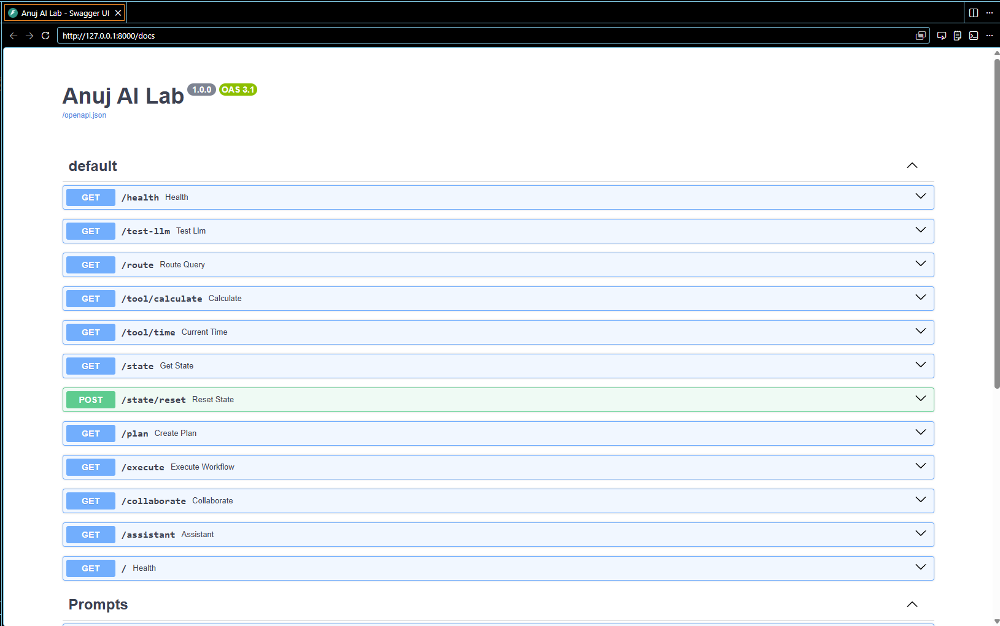
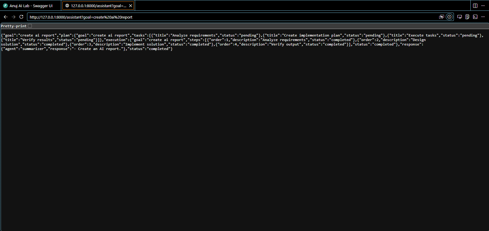
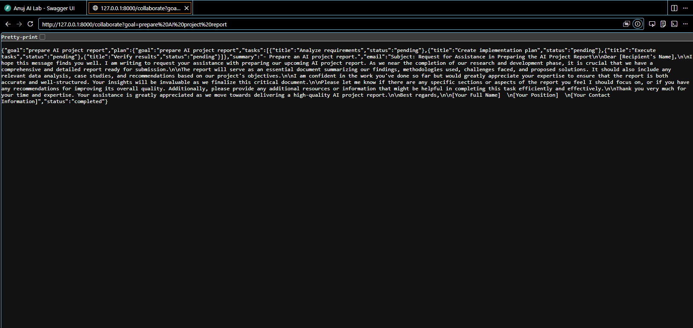
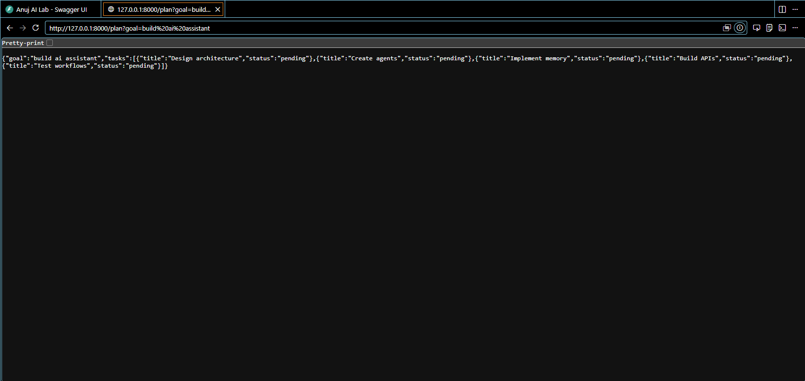
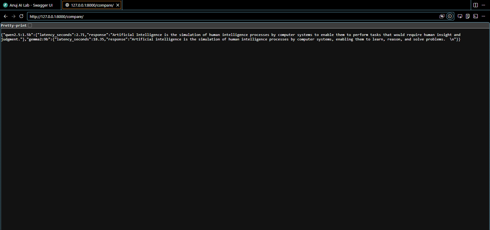
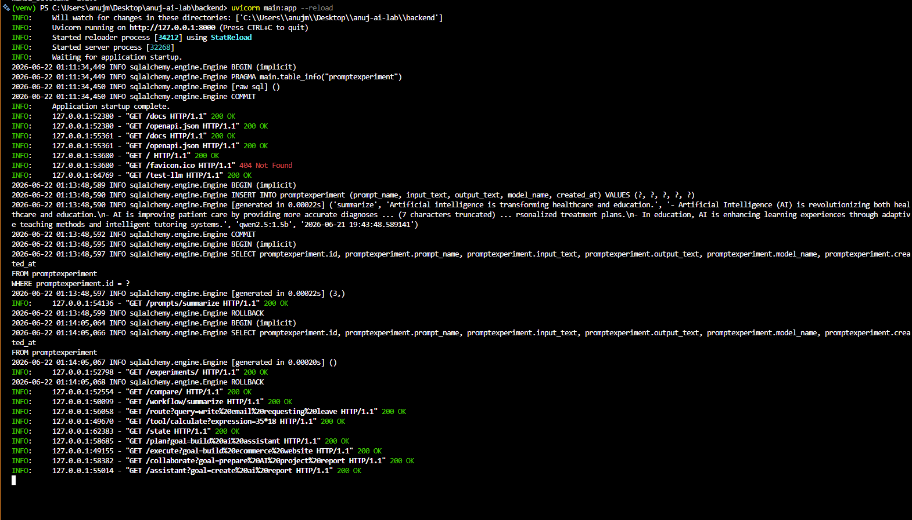
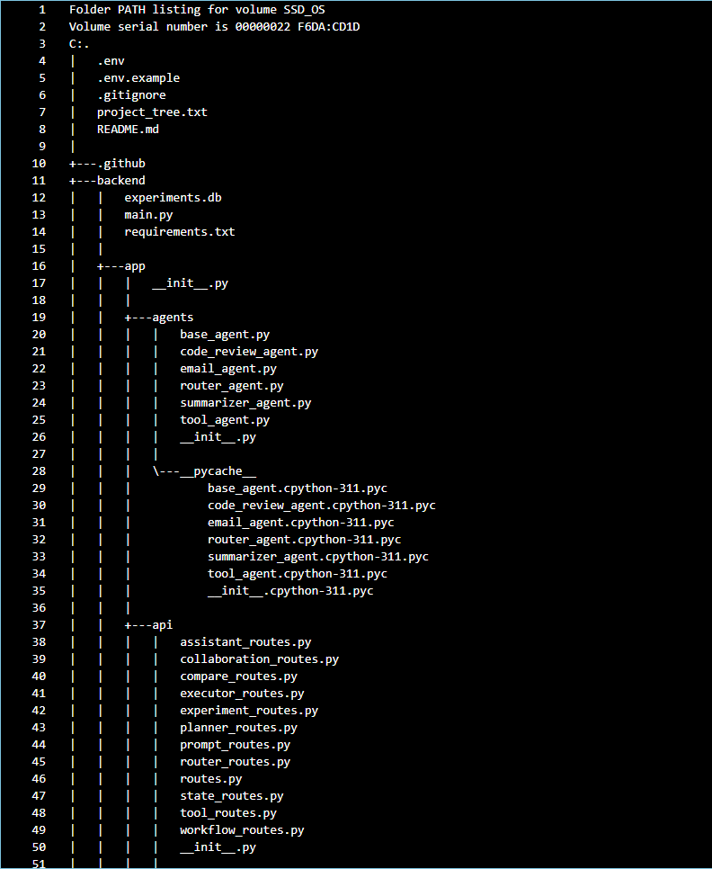

# 🚀 Anuj AI Lab


# Overview

A modular local AI engineering framework built from scratch using **FastAPI**, **Ollama**, **SQLModel**, and an agent-based architecture.

This project demonstrates how to build a local AI system featuring agents, tools, memory, planning, orchestration, experiment tracking, and autonomous execution.

---

# Features

## Core

* Local LLM integration with Ollama
* FastAPI REST APIs
* Prompt Template Engine

## Persistence

* SQLite Experiment Tracking
* Local Conversation Memory
* Agent State Manager

## Agents

* BaseAgent
* SummarizerAgent
* EmailAgent
* CodeReviewAgent
* RouterAgent
* ToolAgent

## Tools

* Calculator Tool
* Datetime Tool

## Orchestration

* Workflow Engine
* Task Planner
* Sequential Workflow Executor
* Multi-Agent Collaboration
* Mini Autonomous AI Assistant

## Evaluation

* Multi-Model Evaluation

## Documentation

* Swagger UI

---

# 🛠 Tech Stack

### Backend
- Python
- FastAPI
- Uvicorn

### AI Models
- Ollama
- qwen2.5:1.5b
- gemma2:9b

### Database
- SQLite
- SQLModel
- SQLAlchemy

### Configuration
- Pydantic
- pydantic-settings
- python-dotenv

### HTTP & APIs
- Requests
- HTTPX

### Logging
- Loguru

### Testing
- Pytest

### Version Control
- Git
- GitHub

---

# Architecture

```
                           Ollama
                 qwen2.5:1.5b / gemma2:9b
                               │
                               ▼
                        FastAPI Backend
                               │
══════════════════════════════════════════════
                               │
                ┌──────────────┼──────────────┐
                ▼              ▼              ▼
             Agents          Tools          Memory
                │              │              │
         BaseAgent        CalculatorTool   Local JSON
         SummarizerAgent  DatetimeTool     Conversation Memory
         EmailAgent
         CodeReviewAgent
         RouterAgent
         ToolAgent
                │
                ▼
══════════════════════════════════════════════
                │
                ▼
            Task Planner
                │
                ▼
       Sequential Executor
                │
                ▼
      Multi-Agent Collaboration
                │
                ▼
      Mini Autonomous Assistant
                │
══════════════════════════════════════════════
                │
                ▼
          Agent State Manager
                │
══════════════════════════════════════════════
                │
                ▼
       SQLite Experiment Tracking
             SQLModel + SQLite
                │
══════════════════════════════════════════════
                │
                ▼
         Multi-Model Evaluation
```

---

## Project Tree

```
anuj-ai-lab
│
├── backend
│   ├── app
│   │   ├── agents
│   │   ├── api
│   │   ├── assistant
│   │   ├── collaboration
│   │   ├── core
│   │   ├── db
│   │   ├── executor
│   │   ├── memory
│   │   ├── models
│   │   ├── planner
│   │   ├── services
│   │   ├── state
│   │   ├── tools
│   │   ├── workflows
│   │   ├── rag
│   │   ├── multimodal
│   │   └── utils
│   │
│   ├── prompts
│   ├── tests
│   ├── data
│   ├── main.py
│   └── requirements.txt
│
├── assets
│   └── screenshots
│
├── .env.example
├── .gitignore
└── README.md
```

---

# Installation

Clone the repository:

```bash
git clone https://github.com/anujmundu/anuj-ai-lab.git
cd anuj-ai-lab/backend
```

Create virtual environment:

```bash
python -m venv venv
```

Activate:

Windows:

```bash
venv\Scripts\activate
```

Install dependencies:

```bash
pip install -r requirements.txt
```

---

# Ollama Setup

Start Ollama:

```bash
ollama serve
```

Pull models:

```bash
ollama pull qwen2.5:1.5b
ollama pull gemma2:9b
```

---

# Run FastAPI

```bash
uvicorn main:app --reload
```

Open:

```
http://127.0.0.1:8000
```

Swagger UI:

```
http://127.0.0.1:8000/docs
```

---

# Major Endpoints

| Endpoint              | Description               |
| --------------------- | ------------------------- |
| `/test-llm`           | Ollama test               |
| `/prompts/summarize`  | Prompt templates          |
| `/experiments`        | SQLite experiments        |
| `/compare`            | Multi-model evaluation    |
| `/workflow/summarize` | Workflow engine           |
| `/route`              | Router agent              |
| `/tool/calculate`     | Calculator tool           |
| `/state`              | Agent state manager       |
| `/plan`               | Task planner              |
| `/execute`            | Sequential executor       |
| `/collaborate`        | Multi-agent collaboration |
| `/assistant`          | Autonomous assistant      |
| `/docs`               | Swagger documentation     |

---

# 📸 Screenshots

## Swagger API Documentation



---

## Autonomous Assistant



---

## Multi-Agent Collaboration



---

## Task Planner



---

## Multi-Model Evaluation



---

## Terminal Proof



---

## Project Structure



---

Additional screenshots demonstrating every module are available in:

```text
assets/screenshots/
```

Including:

- Root Endpoint
- Test LLM Endpoint
- Prompt Template Engine
- SQLite Experiment Tracking
- Multi-Model Evaluation
- Workflow Engine
- Router Agent
- Tool Agent
- State Manager
- Task Planner
- Sequential Workflow Executor
- Multi-Agent Collaboration Engine
- Mini Autonomous Assistant
- Swagger API Documentation
- Terminal Proof Logs
- Project Tree Structure

---

# Stage 1 Timeline

### Jun 17, 2026

* Initialize project structure

### Jun 18, 2026

* Configuration layer
* Environment setup
* Ollama integration

### Jun 19, 2026

* Prompt templates
* Experiment tracking
* Multi-model evaluation

### Jun 20, 2026

* Workflow engine
* Local memory
* Router agent
* Tool agent
* State manager
* Task planner

### Jun 21, 2026

* Sequential executor
* Multi-agent collaboration
* Mini autonomous assistant

### Jun 22, 2026

* Repository Documentation
* Portfolio Proof Collection
* Stage 1 Completion

---

# Future Roadmap

## Stage 2

* API Connectors
* Voice Agents
* MCP Servers

## Stage 3

* Vector Databases
* Embeddings
* RAG Systems

## Stage 4

* LangGraph
* Multi-Agent Systems
* Autonomous Agents

## Stage 5

* Production Deployment
* Docker
* Monitoring
* CI/CD

---

# Stage 1 Status

## ✅ Completed

Built with:

- Python
- FastAPI
- Ollama
- SQLModel
- SQLite
- Agent Architecture
- Modular Design

Release:

v1.0.0 — Stage 1 Complete

---

# 🌟 Highlights

- Built completely from scratch.
- Modular agent-based architecture.
- Local LLM inference using Ollama.
- SQLite experiment tracking.
- Workflow orchestration and planning.
- Multi-agent collaboration.
- Autonomous assistant.
- Fully documented with screenshots and Swagger APIs.

---

## 👨‍💻 Author

**Anuj Mundu**

Master of Computer Applications (MCA)  
[Maulana Azad National Institute of Technology Bhopal (MANIT)](https://manit.ac.in)

AI Engineering • Data Science • Machine Learning
