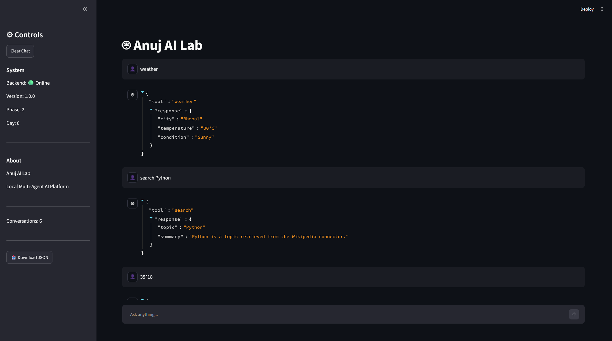
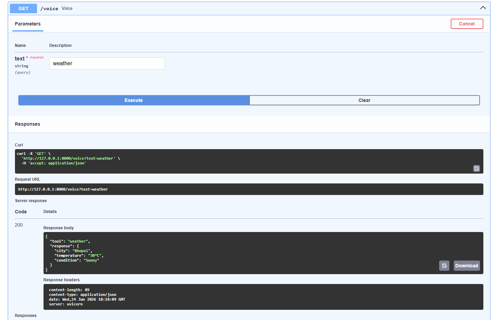
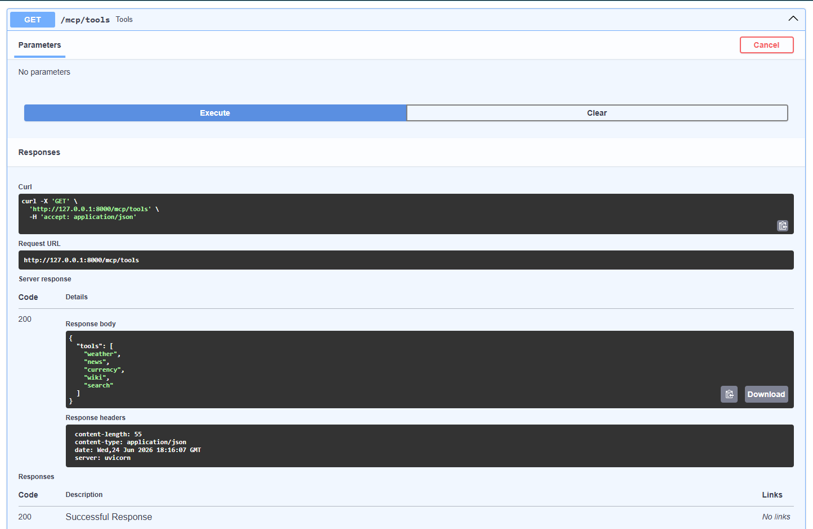

# 🚀 Anuj AI Lab


# Overview

A modular local AI engineering framework built from scratch using **FastAPI**, **Ollama**, **SQLModel**, and an agent-based architecture.

This project demonstrates how to build a local AI system featuring agents, tools, memory, planning, orchestration, experiment tracking, and autonomous execution.

---

# Portfolio Summary

Current Version: v1.1.0

Modules Built:

✅ Agents  
✅ Memory  
✅ Planning  
✅ Workflows  
✅ Autonomous Assistant  
✅ Connectors  
✅ Tools  
✅ Search  
✅ File Processing  
✅ Voice AI  
✅ Streamlit UI  
✅ MCP Foundations

Next Milestone:

🚀 Stage 3 — RAG Systems & Vector Databases

---

# Features

## Core AI Platform

* Local LLM Integration (Ollama)
* FastAPI REST APIs
* Prompt Template Engine
* Multi-Model Evaluation

## Memory & Persistence

* SQLite Experiment Tracking
* Local Conversation Memory
* Persistent Memory System
* Agent State Manager

## Agents

* BaseAgent
* SummarizerAgent
* EmailAgent
* CodeReviewAgent
* RouterAgent
* ToolAgent
* VoiceAgent
* Mini Autonomous Assistant

## External Connectors

* Weather Connector
* News Connector
* Currency Connector
* Wikipedia Connector
* Search Connector

## File Processing

* TXT Reader
* CSV Reader
* PDF Reader

## Voice AI

* Whisper Service
* Text-to-Speech Service
* Voice Agent API

## MCP (Model Context Protocol)

* MCP Tool Registry
* MCP Tool Discovery
* MCP Tool Execution Server

## Orchestration

* Workflow Engine
* Task Planner
* Sequential Workflow Executor
* Multi-Agent Collaboration

## Frontend

* Streamlit Chat Interface

## Documentation

* Swagger UI
* Architecture Documentation
* Screenshots & Proofs


---

# 🛠 Tech Stack

### Backend
- Python
- FastAPI
- Uvicorn

### AI Models
- Ollama
- qwen2.5:1.5b
- gemma2:9b

### Database
- SQLite
- SQLModel
- SQLAlchemy

### Configuration
- Pydantic
- pydantic-settings
- python-dotenv

### HTTP & APIs
- Requests
- HTTPX

### Logging
- Loguru

### Testing
- Pytest

### Version Control
- Git
- GitHub

### Frontend
- Streamlit

---

# Architecture

```text
                    Streamlit Chat UI
                             │
                             ▼
                     FastAPI Backend
                             │
══════════════════════════════════════════════
                             │
      ┌──────────────┬──────────────┬──────────────┐
      ▼              ▼              ▼              ▼
    Agents         Tools           MCP          State Manager 
      │              │              │
      ▼              ▼              ▼
 RouterAgent    Calculator     Tool Registry
 ToolAgent      Weather        MCP Server
 VoiceAgent     News
 EmailAgent     Currency
 Summarizer     Wiki
 CodeReview     Search
                             │
══════════════════════════════════════════════
                             ▼
                       Connectors
                             │
      ┌──────────────┬──────────────┬──────────────┐
      ▼              ▼              ▼
  Weather API      Wikipedia      Search
  News API         Connector      Connector
  Currency API
                             │
══════════════════════════════════════════════
                             ▼
                     Memory Layer
                             │
      ┌──────────────┬──────────────┐
      ▼              ▼              ▼
 Local Memory   Persistent Memory  State Manager
                             │
══════════════════════════════════════════════
                             ▼
                      SQLite Database
                             │
══════════════════════════════════════════════
                             ▼
                  Workflow Orchestration
                             │
      ┌──────────────┬──────────────┬──────────────┐
      ▼              ▼              ▼
   Planner      Executor      Collaboration
```

---

## Project Tree

```text
anuj-ai-lab
│
├── backend
│   │
│   ├── app
│   │   │
│   │   ├── agents
│   │   │   ├── base_agent.py
│   │   │   ├── summarizer_agent.py
│   │   │   ├── email_agent.py
│   │   │   ├── code_review_agent.py
│   │   │   ├── router_agent.py
│   │   │   └── tool_agent.py
│   │   │
│   │   ├── api
│   │   │   ├── routes.py
│   │   │   ├── prompt_routes.py
│   │   │   ├── experiment_routes.py
│   │   │   ├── compare_routes.py
│   │   │   ├── workflow_routes.py
│   │   │   ├── router_routes.py
│   │   │   ├── tool_routes.py
│   │   │   ├── state_routes.py
│   │   │   ├── planner_routes.py
│   │   │   ├── executor_routes.py
│   │   │   ├── collaboration_routes.py
│   │   │   ├── assistant_routes.py
│   │   │   ├── connector_routes.py
│   │   │   ├── file_routes.py
│   │   │   ├── search_routes.py
│   │   │   ├── voice_routes.py
│   │   │   └── mcp_routes.py
│   │   │
│   │   ├── assistant
│   │   ├── collaboration
│   │   ├── connectors
│   │   ├── core
│   │   ├── db
│   │   ├── executor
│   │   ├── memory
│   │   ├── mcp
│   │   │   ├── tool_registry.py
│   │   │   └── mcp_server.py
│   │   │
│   │   ├── models
│   │   ├── planner
│   │   ├── search
│   │   │   └── search_connector.py
│   │   │
│   │   ├── services
│   │   ├── state
│   │   ├── tools
│   │   ├── voice
│   │   │   ├── whisper_service.py
│   │   │   ├── tts_service.py
│   │   │   └── voice_agent.py
│   │   │
│   │   ├── workflows
│   │   ├── rag
│   │   ├── multimodal
│   │   └── utils
│   │
│   ├── prompts
│   ├── tests
│   ├── data
│   ├── main.py
│   └── requirements.txt
│
├── frontend
│   ├── app.py
│   └── requirements.txt
│
├── assets
│   └── screenshots
│
├── docs
│
├── .env.example
├── .gitignore
├── README.md
└── LICENSE
```

---

# Installation

Clone the repository:

```bash
git clone https://github.com/anujmundu/anuj-ai-lab.git
cd anuj-ai-lab/backend
```

Create virtual environment:

```bash
python -m venv venv
```

Activate:

Windows:

```bash
venv\Scripts\activate
```

Install dependencies:

```bash
pip install -r requirements.txt
```

---

# Ollama Setup

Start Ollama:

```bash
ollama serve
```

Pull models:

```bash
ollama pull qwen2.5:1.5b
ollama pull gemma2:9b
```

---

# Run FastAPI

```bash
uvicorn main:app --reload
```

Open:

```
http://127.0.0.1:8000
```

Swagger UI:

```
http://127.0.0.1:8000/docs
```

---

# Quick Start

Terminal 1:

```bash
cd backend
uvicorn main:app --reload
```

Terminal 2:

```bash
cd frontend
streamlit run app.py
```

Backend:
http://127.0.0.1:8000

Swagger:
http://127.0.0.1:8000/docs

Frontend:
http://localhost:8501

---

# Major Endpoints

| Endpoint            | Description               |
| ------------------- | ------------------------- |
| /test-llm           | Ollama Test               |
| /prompts/summarize  | Prompt Templates          |
| /experiments        | Experiment Tracking       |
| /compare            | Multi-Model Evaluation    |
| /workflow/summarize | Workflow Engine           |
| /route              | Router Agent              |
| /tool/calculate     | Calculator Tool           |
| /state              | Agent State Manager       |
| /plan               | Task Planner              |
| /execute            | Sequential Executor       |
| /collaborate        | Multi-Agent Collaboration |
| /assistant          | Autonomous Assistant      |
| /search             | Search Connector          |
| /reader/txt         | TXT Reader                |
| /reader/csv         | CSV Reader                |
| /reader/pdf         | PDF Reader                |
| /voice              | Voice Agent               |
| /mcp/tools          | MCP Discovery             |
| /mcp/execute        | MCP Execution             |
| /docs               | Swagger Documentation     |


---

# 📸 Screenshots

## Swagger API Documentation


---

## Autonomous Assistant


---

## Multi-Agent Collaboration


---

## Task Planner


---

## Multi-Model Evaluation


---

## Terminal Proof


---

## Project Structure


---

## Streamlit Chat Interface



---

## MCP Foundations



---

## Voice AI



---

Additional screenshots demonstrating every module are available in:

```text
assets/screenshots/
```

Including:

- Root Endpoint
- Test LLM Endpoint
- Prompt Template Engine
- SQLite Experiment Tracking
- Multi-Model Evaluation
- Workflow Engine
- Router Agent
- Tool Agent
- State Manager
- Task Planner
- Sequential Workflow Executor
- Multi-Agent Collaboration Engine
- Mini Autonomous Assistant
- Swagger API Documentation
- Terminal Proof Logs
- Project Tree Structure

---

# Development Timeline

### Jun 17, 2026

* Initialize project structure

### Jun 18, 2026

* Configuration layer
* Environment setup
* Ollama integration

### Jun 19, 2026

* Prompt templates
* Experiment tracking
* Multi-model evaluation

### Jun 20, 2026

* Workflow engine
* Local memory
* Router agent
* Tool agent
* State manager
* Task planner

### Jun 21, 2026

* Sequential executor
* Multi-agent collaboration
* Mini autonomous assistant

### Jun 22, 2026

* Repository Documentation
* Portfolio Proof Collection
* Stage 1 Completion

### Jun 23, 2026

* External Connectors
* Weather Tool
* News Tool
* Currency Tool
* Wikipedia Connector
* Search Connector

### Jun 24, 2026

* File Connectors (TXT / CSV / PDF)
* Voice AI Foundations
* Streamlit Chat Interface
* Persistent Memory
* MCP Foundations
* Stage 2 Completion

---

# Release History

## v1.1.0 — Stage 2 Complete

Released: June 2026

Added:

- External Connectors
- Search System
- File Readers
- Voice AI
- Streamlit Frontend
- Persistent Memory
- MCP Foundations

---

## v1.0.0 — Stage 1 Complete

Released: June 2026

Added:

- Ollama Integration
- Prompt Engineering
- Experiment Tracking
- Multi-Agent System
- Workflow Engine
- Autonomous Assistant

---

# Future Roadmap

## Stage 3 (Current)

- Vector Databases
- Embeddings
- RAG Pipelines
- Document Retrieval
- Semantic Search

## Stage 4

- LangGraph
- Advanced Multi-Agent Systems
- Long-Term Memory
- Autonomous Workflows

## Stage 5

- Docker
- Kubernetes
- Monitoring
- CI/CD
- Production Deployment

---

# Project Status

## ✅ Stage 1 Complete (v1.0.0)

- Ollama Integration
- Prompt Engineering
- Experiment Tracking
- Memory
- Agents
- Planning
- Workflows
- Autonomous Assistant

## ✅ Stage 2 Complete (v1.1.0)

- External Connectors
- Information Tools
- File Processing
- Search System
- Voice AI
- Streamlit Chat UI
- Persistent Memory
- MCP Foundations

Current Release:

v1.1.0

---

# 🌟 Highlights

- Built completely from scratch.
- Local LLM integration using Ollama.
- Multi-agent architecture.
- Workflow orchestration engine.
- Persistent memory system.
- External connectors and tools.
- File processing capabilities.
- Voice AI integration.
- Streamlit chat interface.
- MCP (Model Context Protocol) foundations.
- SQLite experiment tracking.
- Fully documented with Swagger APIs and screenshots.

---

## 👨‍💻 Author

**Anuj Mundu**

Master of Computer Applications (MCA)  
[Maulana Azad National Institute of Technology Bhopal (MANIT)](https://manit.ac.in)

AI Engineering • Data Science • Machine Learning

GitHub:
https://github.com/anujmundu

Current Focus:
Building Production-Ready Agentic AI Systems
