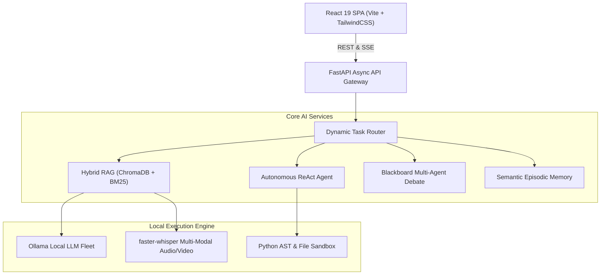

# Project Showcase & System Blueprint

**Anuj AI Lab** is a high-performance local AI engineering workstation featuring multi-modal RAG, autonomous ReAct agents, multi-agent debate deliberation, semantic episodic memory, and real-time telemetry diagnostics.

---

## 🏛️ Architecture Highlights

---

## 🌟 Key Capabilities
- **Grounded Semantic RAG**: ChromaDB dense vector indexing + BM25 sparse keyword ranking with parent-child hierarchical chunking.
- **Autonomous Tool Execution**: Sandboxed Python REPL, AST math calculator, and local directory file system manipulation.
- **Multi-Agent Consensus**: Collaborative blackboard deliberation with custom personas (Researcher, Skeptic, Architect, Synthesizer).
- **Adaptive UI Aesthetics**: 12 curated theme modes, 12 dedicated accent color palettes, and responsive multi-device layouts.
